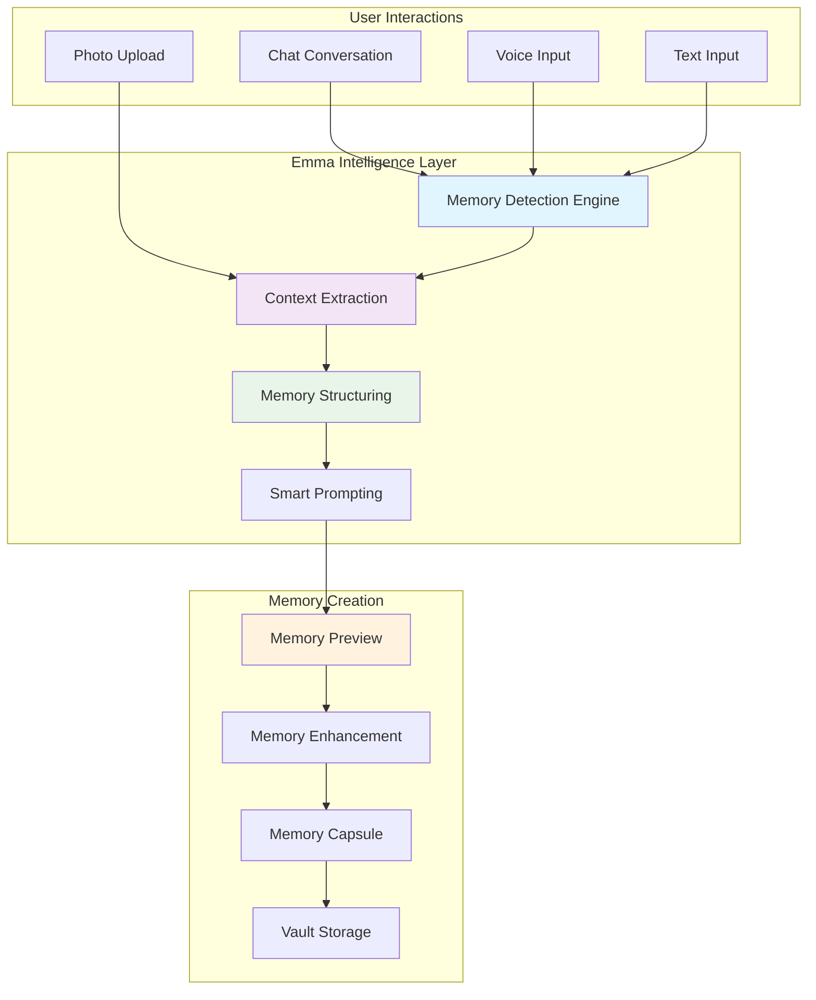

# 🧠 Emma Intelligent Memory Capture - Revolutionary Design Document

## 🎯 Executive Summary

This document outlines the transformation of memory capture from a manual task to an intelligent conversation with Emma. Using vectorless AI, Emma becomes the **gatekeeper of all memories**, intelligently extracting, structuring, and preserving moments from natural interactions.

## 🌟 Vision: Emma as Memory Gatekeeper

### The Paradigm Shift

**OLD WAY**: Users fill out forms → Save to vault
**NEW WAY**: Users have conversations → Emma creates memories

Emma understands context, identifies important moments, and crafts beautiful memory capsules - all through natural conversation.

## 🏗️ System Architecture

### Core Components



## 💬 Conversational Memory Capture Flow

### Example 1: Natural Conversation to Memory

```
User: "I had the most amazing day at the beach with the kids today!"

Emma: "That sounds wonderful! I can feel the joy in your words. Tell me, what made it so special? 🏖️"

User: "Well, little Sarah finally learned to swim! And Tommy built his first sandcastle. We stayed until sunset."

Emma: "What a milestone day! Sarah learning to swim - that must have been so exciting to witness. I'm creating a memory capsule of this special beach day. Here's what I captured:

📝 **Memory Preview**:
Title: "Sarah's First Swim & Beach Milestones"
Date: Today
People: Sarah, Tommy
Emotions: Joy, Pride, Achievement
Content: "A perfect beach day where Sarah conquered her fear and learned to swim while Tommy built his first sandcastle. The family stayed until sunset, celebrating these precious milestones."

Would you like me to add any photos or adjust anything? 

[Save Memory] [Add Photos] [Edit Details]"
```

### Example 2: Photo-Triggered Memory

```
User: [Uploads family dinner photo]

Emma: "What a lovely gathering! I see several people around the table. This looks like a special occasion. Who's with you in this moment? 🍽️"

User: "That's mom's 80th birthday dinner"

Emma: "How wonderful - celebrating 80 years! I can see the warmth and love in this photo. Can you tell me who's gathered here to celebrate with your mom?"

User: "All the kids made it home - even Jake flew in from Seattle"

Emma: "That's so special when everyone comes together! Here's the memory I've crafted:

📝 **Memory Preview**:
Title: "Mom's 80th Birthday - Complete Family Reunion"
Date: [Extracted from photo]
People: Mom, Jake (from Seattle), [Others detected: 6 people]
Emotions: Love, Celebration, Togetherness
Content: "A rare and precious moment with the entire family gathered to celebrate Mom's 80th birthday. Even Jake made the journey from Seattle, making this reunion complete."
Photo: [Attached]

Should I note anything else special about this celebration?

[Save Memory] [Tag More People] [Add Details]"
```

## 🧠 Intelligent Memory Detection Patterns

### What Emma Looks For

#### 🎯 **Milestone Moments**
- First times ("first swim", "learned to walk")
- Achievements ("graduated", "got the job")
- Anniversaries and birthdays
- Life transitions

#### 💝 **Emotional Peaks**
- Strong emotional language ("amazing", "incredible", "devastating")
- Exclamation points and emotional punctuation
- Emoji usage patterns
- Tone analysis

#### 👥 **Relationship Moments**
- Family gatherings
- Mentions of specific people
- Shared experiences
- Reunion indicators

#### 📸 **Visual Memories**
- Photo uploads with context
- Descriptive visual language
- Scene setting ("sunset", "beach", "garden")

### Memory Importance Scoring

```javascript
calculateMemoryImportance(context) {
  let score = 0;
  
  // Milestone indicators
  if (context.includes(['first', 'learned', 'finally'])) score += 3;
  
  // Emotional intensity
  const emotionLevel = analyzeEmotionalIntensity(context);
  score += emotionLevel * 2;
  
  // People mentioned
  const peopleCount = extractPeople(context).length;
  score += Math.min(peopleCount, 3);
  
  // Temporal significance
  if (isAnniversary(context) || isBirthday(context)) score += 2;
  
  // Rarity
  if (context.includes(['everyone', 'whole family', 'first time in'])) score += 2;
  
  return score; // 0-12 scale
}
```

## 🎨 UI/UX Design Principles

### 1. **Invisible Interface**
- No forms to fill
- No buttons to find
- Just natural conversation

### 2. **Progressive Disclosure**
- Emma reveals understanding gradually
- Shows memory preview before saving
- Allows refinement without friction

### 3. **Contextual Intelligence**
- Right questions at right time
- Adaptive to user's communication style
- Remembers conversation context

### 4. **Visual Feedback**
- Memory detection indicators in chat
- Real-time preview generation
- Confidence indicators

## 🔧 Technical Implementation

### Memory Extraction Engine

```javascript
class IntelligentMemoryExtractor {
  constructor(vectorlessEngine) {
    this.vectorless = vectorlessEngine;
    this.conversationContext = [];
    this.detectedMemories = [];
  }

  async analyzeMessage(message, attachments = []) {
    // Add to conversation context
    this.conversationContext.push({
      content: message,
      attachments,
      timestamp: Date.now()
    });
    
    // Detect if memory-worthy
    const memorySignals = await this.detectMemorySignals(message);
    
    if (memorySignals.isMemoryWorthy) {
      // Extract memory components
      const memory = await this.extractMemoryComponents({
        message,
        context: this.conversationContext,
        attachments,
        signals: memorySignals
      });
      
      // Generate follow-up questions
      const prompts = await this.generateSmartPrompts(memory);
      
      return {
        detectedMemory: memory,
        followUpPrompts: prompts,
        confidence: memorySignals.confidence
      };
    }
    
    return null;
  }

  async detectMemorySignals(message) {
    // Use vectorless AI to analyze
    const analysis = await this.vectorless.analyzeForMemoryPotential(message);
    
    return {
      isMemoryWorthy: analysis.score > 5,
      confidence: analysis.confidence,
      type: analysis.memoryType,
      emotions: analysis.emotions,
      people: analysis.detectedPeople
    };
  }

  async extractMemoryComponents(data) {
    // Smart extraction using vectorless AI
    const components = await this.vectorless.extractMemoryStructure(data);
    
    return {
      title: components.suggestedTitle,
      content: components.enrichedContent,
      metadata: {
        emotions: components.emotions,
        people: components.people,
        location: components.location,
        tags: components.autoTags,
        importance: components.importanceScore
      },
      attachments: data.attachments
    };
  }

  async generateSmartPrompts(memory) {
    // Context-aware follow-up questions
    const prompts = await this.vectorless.generateFollowUpQuestions(memory);
    
    return prompts.map(p => ({
      question: p.text,
      purpose: p.purpose,
      expectedInfo: p.expectedInfo
    }));
  }
}
```

### Chat-to-Memory Integration

```javascript
class ChatMemoryIntegration {
  constructor(chatInterface, memoryExtractor) {
    this.chat = chatInterface;
    this.extractor = memoryExtractor;
    this.pendingMemories = new Map();
  }

  async onChatMessage(message) {
    // Analyze for memory potential
    const result = await this.extractor.analyzeMessage(message.content);
    
    if (result && result.detectedMemory) {
      // Show inline memory detection
      this.showMemoryDetectionIndicator(message.id);
      
      // Store pending memory
      this.pendingMemories.set(message.id, result.detectedMemory);
      
      // Ask follow-up if needed
      if (result.followUpPrompts.length > 0) {
        this.chat.addEmmaResponse(
          result.followUpPrompts[0].question,
          { type: 'memory-followup' }
        );
      } else {
        // Show memory preview
        this.showMemoryPreview(result.detectedMemory);
      }
    }
  }

  showMemoryDetectionIndicator(messageId) {
    // Add visual indicator to message
    const indicator = document.createElement('div');
    indicator.className = 'memory-detection-indicator';
    indicator.innerHTML = `
      <span class="pulse-dot"></span>
      <span>Emma detected a memory</span>
      <button onclick="saveMemoryFromChat('${messageId}')">
        Save as Memory
      </button>
    `;
    
    // Attach to message element
    const messageEl = document.getElementById(`message-${messageId}`);
    messageEl.appendChild(indicator);
  }

  async saveMemoryFromChat(messageId) {
    const memory = this.pendingMemories.get(messageId);
    if (!memory) return;
    
    // Show preview with save options
    const preview = await this.generateMemoryPreview(memory);
    this.chat.showMemoryDialog(preview);
  }
}
```

## 🤗 Dementia-Optimized Features

### Validation-First Approach

```javascript
// Never correct, always validate
if (dementiaMode) {
  // User says: "I saw my mother yesterday"
  // Even if mother passed away, Emma responds:
  // "Tell me about your visit with your mother. What did you do together?"
  
  // Extract the emotional truth, not factual accuracy
  const emotionalContent = extractEmotionalTruth(userInput);
  const memory = createValidationMemory(emotionalContent);
}
```

### Simplified Prompting

```javascript
generateDementiaPrompts(context) {
  return [
    "That sounds nice. Tell me more.",
    "Who was with you?",
    "How did that make you feel?",
    "What happened next?"
  ].filter(prompt => isRelevantToContext(prompt, context));
}
```

### Repetition Handling

```javascript
// Detect repeated stories without highlighting repetition
if (isRepeatedStory(story)) {
  // Still create new memory capsule
  // Each telling might have new details
  const newDetails = extractNewDetails(story, previousVersions);
  const enrichedMemory = mergeMemoryVersions(story, newDetails);
}
```

## 🚀 Implementation Phases

### Phase 1: Core Engine (Week 1-2)
- Memory detection algorithm
- Context extraction system
- Basic memory structuring
- Initial prompt generation

### Phase 2: Chat Integration (Week 3-4)
- Inline memory detection UI
- Save-from-chat functionality
- Memory preview system
- Real-time indicators

### Phase 3: Advanced Intelligence (Week 5-6)
- Multi-modal understanding
- Temporal reasoning
- Relationship mapping
- Auto-categorization

### Phase 4: Optimization (Week 7-8)
- Performance tuning
- Dementia specialization
- Batch memory processing
- Export capabilities

## 📊 Success Metrics

### User Experience
- **Memory Creation Time**: <30 seconds vs. 5+ minutes manual
- **Completion Rate**: 95% vs. 60% for forms
- **Memory Quality**: Professional-grade narratives
- **User Satisfaction**: "Feels like magic"

### Technical Performance
- **Detection Accuracy**: 90%+ for significant moments
- **False Positives**: <5% non-memories detected
- **Processing Speed**: Real-time detection
- **Context Retention**: Full conversation awareness

### Dementia Care
- **Validation Success**: 100% supportive responses
- **Engagement Rate**: 3x higher than forms
- **Caregiver Satisfaction**: Reduced burden
- **Memory Preservation**: 10x more memories captured

## 🎯 Competitive Advantage

### Why This Changes Everything

1. **Zero Friction**: Memories happen in conversation, not forms
2. **Intelligence**: Emma understands context and importance
3. **Completeness**: Captures details users would forget to add
4. **Accessibility**: Natural language is universal
5. **Empathy**: Emma cares about the story, not just data

### Market Position

- **vs. Photo Apps**: We understand the story behind photos
- **vs. Journal Apps**: We extract memories from conversation
- **vs. Social Media**: We preserve privately with intelligence
- **vs. Traditional Forms**: We eliminate the work entirely

## 🌟 The Future of Memory Preservation

Imagine a world where:
- Every important moment is automatically preserved
- Memories are crafted with professional storytelling
- Nothing significant is ever forgotten
- Memory capture requires zero effort
- Emma knows what matters to you

**This is the future we're building - where Emma isn't just a tool, but an intelligent companion who ensures your life story is beautifully preserved.** 🧠💝

---

*"The best interface is no interface. The best memory capture is the one that happens naturally in conversation."* - Emma Team Vision
